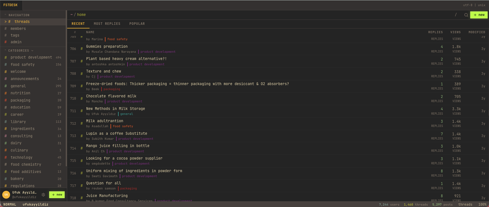

# forum-lite

**A serverless, SEO-ready forum for Cloudflare Workers, D1, R2 and React.**

forum-lite is a compact open-source forum engine that runs as a single Cloudflare Worker: React frontend, Hono API, D1 database, optional R2 uploads, optional Cloudflare Email, admin tools, ads, sitemaps and structured data included.



[](#license)
[](https://workers.cloudflare.com/)
[](https://developers.cloudflare.com/d1/)
[](https://vite.dev/)

## Why Star It?

- **One Worker, full forum:** frontend, API, assets and SEO routes ship together.
- **Cloudflare-native:** D1 for data, R2 for uploads, Email Sending for transactional mail.
- **SEO built in:** canonical URLs, dynamic Open Graph WebP images, JSON-LD, robots.txt and sitemap index.
- **Public-safe config:** tracked Cloudflare config uses placeholders; real IDs stay in ignored local files or dashboard bindings.
- **Admin-ready:** users, roles, categories, tags, settings, ads and activity logs are included.
- **Distinct UI:** terminal-inspired Gruvbox Dark interface with dense tables and fast navigation.

## Features

- Threads, replies, likes, quotes and markdown rendering
- Categories, tags, members, profiles and search
- Admin dashboard, role management, moderation controls and settings
- PBKDF2 password hashing and D1-backed sessions
- Password reset by sending a new 8-character password, no reset-link flow
- R2 file attachments with inline image rendering
- Cloudflare Email welcome and password messages
- AdSense-compatible ad management, per-thread ad intervals and dynamic `ads.txt`
- SEO routes: `/robots.txt`, `/sitemap.xml`, `/sitemap-index.xml`, category/thread/user/tag sitemaps
- Structured data: `WebSite`, `CollectionPage`, `ItemList`, `DiscussionForumPosting`, `ProfilePage`, `BreadcrumbList`

## Tech Stack

| Layer | Technology |
|---|---|
| Runtime | Cloudflare Workers |
| Backend | Hono |
| Database | Cloudflare D1 + Drizzle ORM |
| Storage | Cloudflare R2 |
| Frontend | React 18, Vite 6, React Router 7 |
| Data fetching | TanStack Query |
| Security | DOMPurify, Zod, PBKDF2/Web Crypto |
| Styling | Custom CSS, Gruvbox Dark, JetBrains Mono |

## Quick Start

```bash
git clone https://github.com/YOUR_NAME/forum-lite.git
cd forum-lite/forum-lite
npm install
npm run dev
```

Root-level shortcuts are also available:

```bash
npm run dev
npm run build
```

## Deploy To Cloudflare

```bash
cd forum-lite
npx wrangler login
npm run deploy
```

Create and bind a D1 database:

```bash
npx wrangler d1 create forum-db
npx wrangler d1 migrations apply forum-db --remote --migrations-dir=migrations
```

Optional services:

```bash
npx wrangler r2 bucket create forum-lite-uploads
npx wrangler email sending enable example.com
```

If you use R2 or Cloudflare Email, update the public binding values in `forum-lite/wrangler.jsonc` to your own bucket and verified sender before deploying.

Worker binding names:

| Binding | Type | Required |
|---|---|---|
| `DB` | D1 Database | Yes |
| `ASSETS` | Static Assets | Yes |
| `BUCKET` | R2 Bucket | No |
| `SEND_EMAIL` | Send Email | No |

Detailed setup guide: [forum-lite/README.md](forum-lite/README.md)

Email Verify is passive only: syntax, typo/disposable-domain, MX and A/AAAA checks. It never sends mail and does not run mailbox probes. Cloudflare failed/rejected delivery events are the source for mailbox, quota and suppression decisions.

## Public Repository Safety

The current tracked source is suitable for a public repository:

- No live API token, secret key or database password is tracked.
- `forum-lite/wrangler.jsonc` uses a placeholder D1 id.
- `forum-lite/wrangler.local.jsonc`, `.dev.vars`, `.wrangler/`, `dist/` and `node_modules/` are ignored.
- Runtime service access is handled through Cloudflare bindings, not hardcoded credentials.

Important for this working copy: older Git history contains private setup artifacts from early development. Before flipping an existing private repo to public, publish a clean history:

```bash
git checkout --orphan public-main
git add .
git commit -m "Public release"
git branch -M main
git push --force-with-lease origin main
```

Only do this when you intentionally want to replace the remote history.

## GitHub Discovery

Suggested repository description:

> Serverless forum software for Cloudflare Workers, D1, R2 and React. SEO-ready, open-source, with admin tools, ads, sitemaps and dynamic Open Graph images.

Suggested GitHub topics:

`cloudflare-workers`, `cloudflare-d1`, `cloudflare-r2`, `hono`, `react`, `vite`, `forum`, `discussion-forum`, `serverless`, `seo`, `open-graph`, `sqlite`, `drizzle-orm`, `typescript`

More SEO and launch notes: [SEO.md](SEO.md)

## License

MIT. See [LICENSE](LICENSE).
